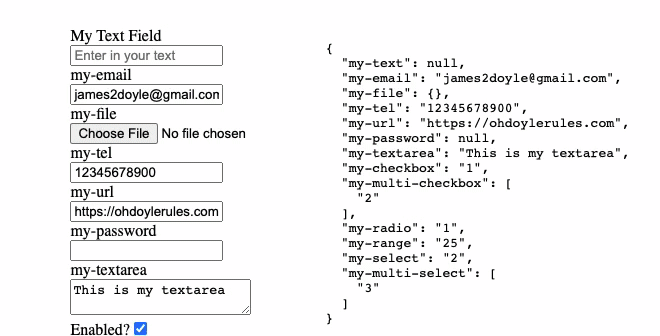

Vue Stateful Form
===================

> Create a form that escalates all events to the top level and supports v-model

## Demo



## Features

- [x] uses event delegation from the top level `form` element
- [x] 2 way binding with proper `v-model` support
- [x] unstyled but includes lots of classes to target
- [x] built-in debounce function
- [x] still allows `submit` handler
- [x] encodes "multiple" inputs (select[multiple], radio, checkbox)
- [x] no hacky "mounted" calls
- [x] supports most input elements (no `file`/`image` support)
- [x] sets `ref` for each input automatically
- [x] supports custom components and passing props/attrs

## Installation

```bash
npm install vue-stateful-form
```

### Global Usage

```js
import Vue from 'vue';
import StatefulForm from 'vue-stateful-form';

Vue.component('stateful-form', StatefulForm);
```

### In Single File Components

```js
import StatefulForm from 'vue-stateful-form';

export default {
  // ...
  components: {
    StatefulForm,
  },
  // ...
};
```

## Usage

```vue
<template>
  <div id="app">
    <StatefulForm v-model="data" :schema="schema" @submit="handleSubmit" />
    <pre v-html="JSON.stringify(data, null, 2)"></pre>
  </div>
</template>

<script>
import Vue from 'vue';
import StatefulForm from 'vue-stateful-form';

export default Vue.extend({
  name: 'StatefulFormExample',
  components: {
    StatefulForm
  },
  data() {
    return {
      // here is the model for the fields
      // the name of the key should match the name of the field
      // missing fields will be set to `null`
      data: {
        'my-text': 'This is my text field',
        'my-email': 'james2doyle@gmail.com',
        'my-tel': '12345678900',
        'my-url': 'https://ohdoylerules.com',
        'my-textarea': 'This is my textarea',
        'my-select': '2',
        'my-range': '25',
        'my-checkbox': '1',
        'my-multi-checkbox': ['2'], // multiple values require arrays
        'my-radio': '1',
        'my-multi-select': ['3'], // multiple values require arrays
        'custom-icon': null, // example of custom element with empty starting state
      },
      schema: [
        {
          // name will be used as the field `id` and also the v-model key
          name: 'my-text',
          label: 'My Text Field',
          type: 'text',
          required: true,
          whenEmpty: '', // use `''` instead of `null` when the field is empty
        },
        {
          name: 'my-email',
          label: null, // null label will remove the label
          type: 'email',
          required: true,
        },
        {
          name: 'my-tel',
          type: 'tel',
        },
        {
          name: 'my-url',
          type: 'url',
        },
        {
          name: 'my-password',
          type: 'password',
        },
        {
          name: 'my-textarea',
          type: 'textarea',
        },
        {
          name: 'my-checkbox',
          type: 'checkbox',
          options: [
            // single checkbox is just a single option
            { value: '1', label: 'Enabled?' },
          ],
        },
        {
          name: 'my-multi-checkbox',
          type: 'checkbox',
          options: [
            // multiple checkbox is more than 1 option
            { value: '1', label: 'Checkbox One' },
            { value: '2', label: 'Checkbox Two' },
            { value: '3', label: 'Checkbox Three' },
          ],
        },
        {
          name: 'my-range',
          type: 'range',
          min: '1',
          max: '100',
        },
        {
          name: 'my-select',
          type: 'select',
          options: [
            { value: '1', label: 'One' },
            { value: '2', label: 'Two' },
            { value: '3', label: 'Three' },
          ],
        },
        {
          name: 'my-radio',
          type: 'radio',
          options: [
            // radio is the same as a select
            { value: '1', label: 'Radio One' },
            { value: '2', label: 'Radio Two' },
            { value: '3', label: 'Radio Three' },
          ],
        },
        {
          name: 'my-multi-select',
          type: 'selectMultiple',
          options: [
            // same as a checkbox with multiple
            { value: '1', label: 'One' },
            { value: '2', label: 'Two' },
            { value: '3', label: 'Three' },
          ],
        },
        {
          name: 'custom-icon',
          type: 'EmojiPicker', // custom element registered with `Vue.component(...)`
          options: [
            { value: 'bear', label: '🐻' },
            { value: 'fox', label: '🦊' },
            { value: 'dog', label: '🐶' },
            { value: 'mouse', label: '🐹' },
          ],
        },
        {
          name: 'my-submit',
          type: 'submit',
        },
      ],
    }
  },
  methods: {
    handleSubmit(event) {
      event.preventDefault();

      console.log('submission captured and stopped');
      console.log('data', this.data);

      return false;
    },
  },
});
</script>
```

## Available Props

- *schema*: `Array<StatefulFormDetails>` - the schema for the form (required)
- *debounce*: `number` - only emits the `input` event after a set amount of time has passed (default: `10`)

```typescript
export interface StatefulFormDetails {
  id?: string
  name: string
  label?: string
  type: string
  required?: boolean
  class?: string
  placeholder?: string
  min?: number
  max?: number
  step?: number
  maxlength?: number
  rows?: number
  cols?: number
  pattern?: string
  data?: Vue.VNodeData
  options?: Array<{
    label: string
    value: any
  }>
}
```

## Available Classes

```css
/* the main wrapper class */
.stateful-form {}
/* wrapper for top level input */
.form-input-wrapper {}
/* wrapper for the label */
.form-label-wrapper {}
/* wrapper for radio and checkboxes when there are multiples */
.form-group-label {}
/* the actual text inside the label wrapper */
.form-label-text {}
/* a class applied based on the input tag */
.form-input-input {}
/* a class applied based on the input type */
.form-input-range {}
```

## Custom Components

In order to update the `v-model` using a custom component (not a native input) then you will need to fire the input event on the parent form.

When this event is fired, we serialize the form with `FormData` and update the `v-model` attached to the form. In order for the form to properly pick up the value in your custom element using this approach, you need to hide a hidden input alongside your custom component.

You can see an example of this below:

```html
<template>
  <div class="emoji-picker">
    <!-- hide an input here so that the FormData can pick it up -->
    <input type="hidden" :name="$attrs.name" :value="model">
    <!-- add a handler to the custom input that we can hook in to -->
    <button v-for="option in options" :key="option.value" type="button" :class="{ 'emoji-picker-selected': model === option.value}" @click.prevent="handleClick(option.value)" v-text="option.label"></button>
  </div>
</template>

<script>
export default {
  name: 'EmojiPicker',
  props: {
    // value prop is always passed if a custom component is detected
    value: {
      type: String,
      required: false, // can be null
      default: null,
    },
    options: {
      type: Array,
      required: true,
    },
  },
  data() {
    return {
      // set the initial state to whatever was passed in
      model: this.value,
    };
  },
  methods: {
    handleClick(icon) {
      // update the local state that sets the value of the hidden input
      this.model = icon;

      const evt = new Event('input', { bubbles: true, cancelable: false });
      // emit the native event on the parent form
      this.$parent.$el.dispatchEvent(evt);
    }
  },
};
</script>

<style>
.emoji-picker button {
  cursor: pointer;
  background: #ccc;
  border: 1px solid #999;
  border-radius: 2px;
  margin: 0 0.5rem 1rem 0;
  opacity: 0.5;
  transition: opacity 0.3s ease;
  will-change: opacity;
}
.emoji-picker button:hover {
  opacity: 0.8;
}
.emoji-picker button.emoji-picker-selected {
  opacity: 1;
}
</style>
```

Another option is to bind the `v-model` directly to the custom component and then use a watcher to call the native event:

```html
<template>
  <div class="my-custom-color-picker">
    <!-- hide an input here so that the FormData can pick it up -->
    <input type="hidden" :name="$attrs.name" :value="model">
    <!-- add a handler to the custom input that we can hook in to -->
    <RealNiceColorPicker v-model="model" />
  </div>
</template>

<script>
export default {
  name: 'MyCustomColorPicker',
  // other stuff...
  props: {
    // value prop is always passed if a custom component is detected
    value: {
      type: String,
      required: true,
    },
  },
  data() {
    return {
      // set the initial state to whatever was passed in
      model: this.value,
    };
  },
  watch: {
    model() {
      const evt = new Event('input', { bubbles: true, cancelable: false });
      // emit the native event on the parent form
      this.$parent.$el.dispatchEvent(evt);
    },
  },
};
</script>
```

This approach works nicely if you are using a custom component that doesn't have any events to capture the changes on the component.

## Development

- `npm run serve`: run a development server with a the `serve.vue` page
- `npm run build`: generate the build output
